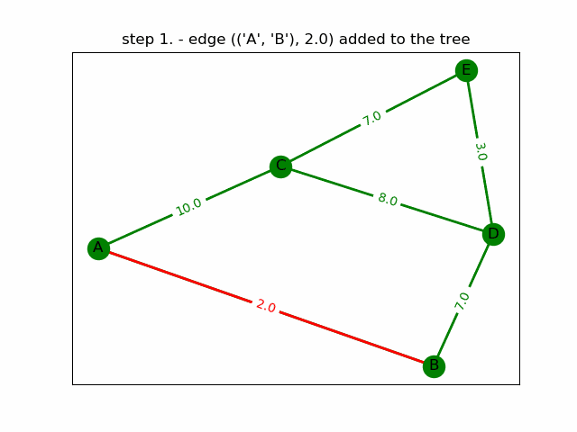

# MstFind

MstFind is a simple application for displaying the process of finding the minimum spanning tree of a graph using Dijkstra's, Kruskal's and Prim's algorithm.

## Basic Usage

Follow the steps below to install the package:

```
git clone git@github.com:mariosasko/mstfind.git
cd mstfind
pip install .
```

Even though it's possible to build a graph by importing the package and then specifying its structure, the easiest way is to run the package as a module and specify the graph structure in a separate file. Instead of running the package as a module, the `mstfind` command is available as a more convenient way to use the package.

To get the list of options, type: `python -m mstfind --help`.

### Example

To find the minimum spanning tree of a graph with the relative path `./graph/graph1.txt` using Dijkstra's algorithm, type the following command:
`python -m mstfind -g ./graph/graph1.txt -a dijkstra -s static`

To display all the steps of the algorithm, type the following command:
`python -m mstfind -g ./graph/graph1.txt -a dijkstra -s dynamic`

The resulting minimum spanning tree is displayed in the gif below:



As you can see it's really easy to define a new graph and plot it in a static or dynamic manner. Dynamic plotting allows you to create gifs. To do so, just add the `--gifpath` option and specify a path where the gif will be saved.

Check the `graphs` directory to find the example graph structures.


> **Note**: The commands used in this example can be found inside `commands.txt`
