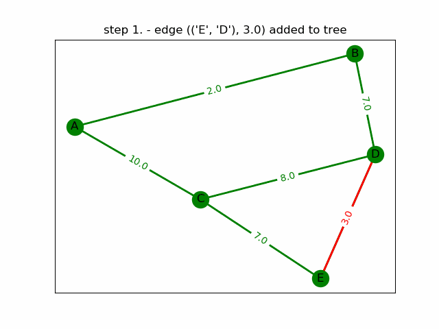

# MstFind

MstFind is a simple application for displaying the process of finding the minimum spanning tree of a graph using Dijkstra's, Kruskal's and Prim's algorithm.

## Basic Usage

```
usage: main.py [-h] [-p PATH] [-a {dijkstra,kruskal,prim}] [-v VERBOSE]
               [-s {static,dynamic}] [--size X,Y]

optional arguments:
  -h, --help            show this help message and exit
  -p PATH, --path PATH  path to the graph
  -a {dijkstra,kruskal,prim}, --algorithm {dijkstra,kruskal,prim}
                        algorithm used to find the minimum spanning tree
  -v VERBOSE, --verbose VERBOSE
                        verbosity level (integer >= 0)
  -s {static,dynamic}, --show {static,dynamic}
                        static or dynamic plotting of the mst
  --gifpath GIFPATH     path of the gif file (use this option only when
                        creating dynamic plots)
  --size X,Y            figure size
```

## Example

To find the minimum spanning tree of a graph with the relative path `./input/graph1.txt` using Dijkstra's algorithm, type the following command:
`python main.py -p ./input/graph1.txt -a dijkstra -s static`

To display all the steps of the algorithm, type the following command:
`python main.py -p ./input/graph1.txt -a dijkstra -s dynamic`



As you can see it's really easy to define a new graph and plot it in static or dynamic manner. Dynamic plotting allows you to create gifs. To do so, just add the `--gifpath` option and specify a path where the gif will be saved. 
> **Note**: Commands used in this example can be found inside `commands.txt`
